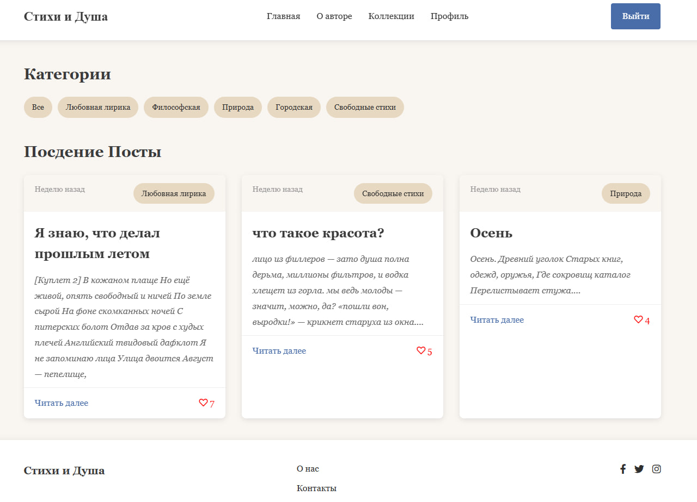

# ✍️ Poetry Blog — Version 1.0

A personal poetry blog where users can register, read, comment, like, and save poems. Featuring intelligent recommendations and user profile analytics — all built with Django.

---

## 🌟 Features

- 🔐 **User Authentication**
  - Register, login, and logout
- 💬 **Comment System**
  - Add and view comments on poems
- ❤️ **Like Functionality**
  - Like and unlike poems
- 📌 **Saved Poems**
  - Save your favorite poems for later
- 🎯 **Smart Recommendations**
  - Suggest poems based on user activity
- 📊 **Profile Analytics**
  - See your activity stats: likes, comments, views
- 🧑 **Profile Management**
  - Update your personal data and avatar

---

## 🖼️ Screenshots

---

## 🛠️ Tech Stack

- **Backend:** Python 3.12, Django 4.2
- **Frontend:** HTML, CSS, JavaScript
- **Database:** SQLite (can be replaced with PostgreSQL)
- **Authentication:** Django built-in auth system
- **UI Styling:** Custom / Tailwind / Bootstrap (optional)

---

## 🚀 Getting Started

Follow these steps to run the project locally:

1. Clone the repository:

   `git clone https://github.com/vladkish/crud.git`  
   `cd crud/backend/`

2. Create and activate a virtual environment:

   `python -m venv venv`  
   On Linux/macOS run: `source venv/bin/activate`  
   On Windows run: `venv\Scripts\activate`

3. Install dependencies:
   `cd crud/backend/`
   `pip install -r requirements.txt`

4. Apply migrations:

   `python manage.py migrate`

5. Run the development server:

   `python manage.py runserver`

6. Open your browser and go to:  
   `http://127.0.0.1:8000/`

---

## 📬 License

MIT — feel free to use and modify.